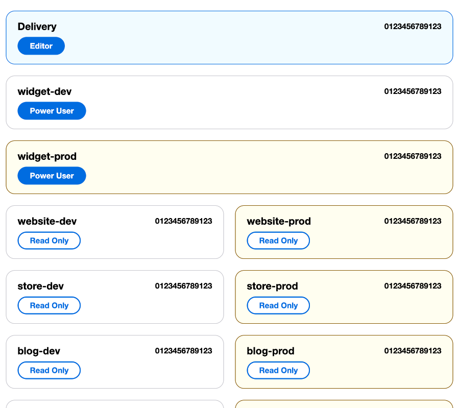

# AWS SAML Signin Beautifier

AWS SAML Signin Beautifier is a project aimed at improving the AWS SAML Signin page by making role selection faster, enhancing UI readability, and adding colors for easier scanning. This is especially useful for users managing multiple AWS accounts.

## What This Project Does

If your company manages many AWS accounts, selecting the right role from the AWS SAML login page (`https://signin.aws.amazon.com/saml`) can be frustrating. This project removes friction from the process by:

- Turning role radio buttons into submit buttons – No need to scroll down and click "Sign In"
- Making the design easier to scan – Quickly find the right role
- Adding color coding for clarity – Visually differentiate accounts

Designed for users managing multiple AWS accounts.

## Options

### 1. Chrome Extension (In Progress)

We are currently working on a Chrome extension that will provide the same enhancements. Until it is submitted to the store, you will need to install it manually. For more details, please refer to the [Chrome Extension](https://github.com/jared-christensen/AWS-SAML-Signin-Beautifier/blob/main/chrome-extension/README.md).

### 2. Tampermonkey Script (Available Now)

You can use the Tampermonkey script right now to improve your AWS SAML Signin experience. For installation instructions, please refer to the [Tampermonkey README](tampermonkey/README.md).

## Screenshot

